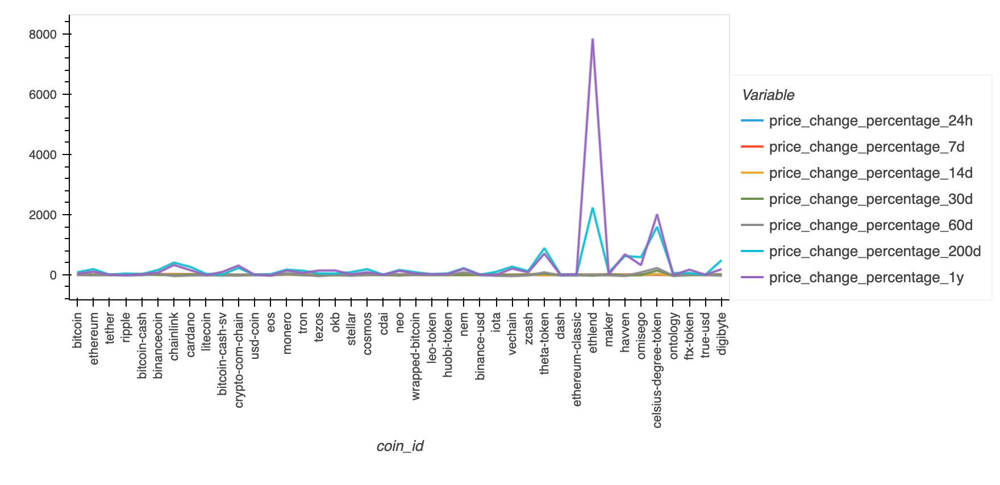
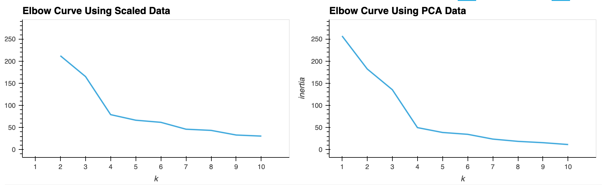
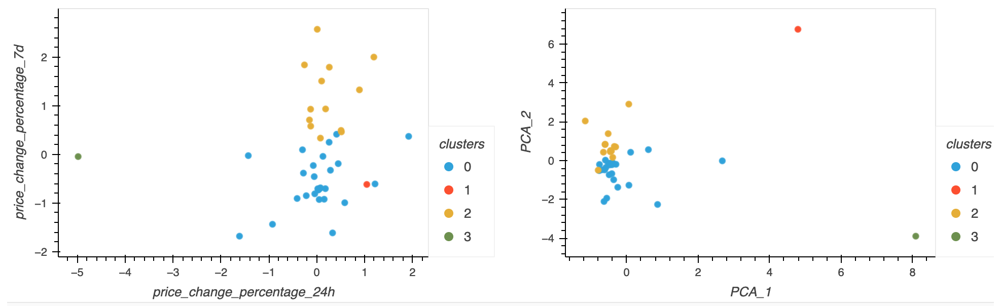

# CryptoClustering
Homework for Module 19 - Unsupervised Machine Learning

This Unsupervised Machine Learning assignment uses the following to predict if Cryptocurrencies are effected by 24-hour or 7-day price changes:

Python
Jupyter Notebook
K-Means
Principle Component Analysis 
Standard Scaler
Pandas
Hvplot

PCA was performed even though the dataset only had 7 columns. Reducing it to the 3 columns with the highest explained variance ration yeilded slightly better results than the scaled data.  

Elbow Curve Composite Plots

Cluster Composite Plots
